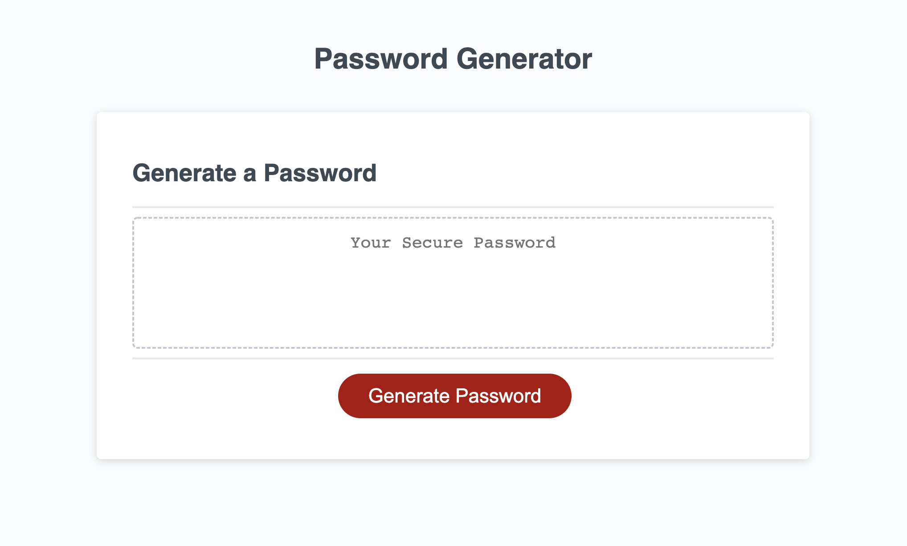
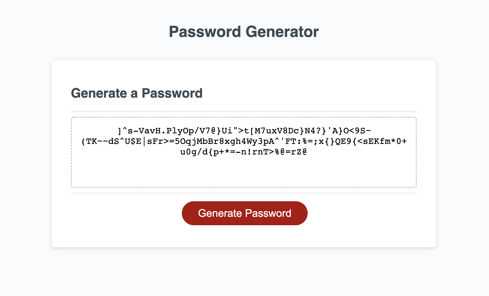

# Password Generator #

## Objective ##

>This coding project was my first foray into Javascript! It involved generating a password based on user defined parameters. The bulk of the code is dedicated to constructing the array over which the for loop will execute. I began with starter code that was missing the main generatePassword() function. (The starter code and my own code are distinguishable from the comments I've added.) The script takes in user input with prompts and confirms for which I wrote validation code.

## Built with:

* HTML
* CSS
* Javascript

## Website:

[Visit the site on Github Pages.](https://jonprice0.github.io/Password-Generator/)

## Here are screenshots of the finished page:

## License

> Naturally, I have not included a license for this simple exercise. :)

## Contributions:

>Made with ❤️ by Jonathan Price with starter code from the UCF coding bootcamp.